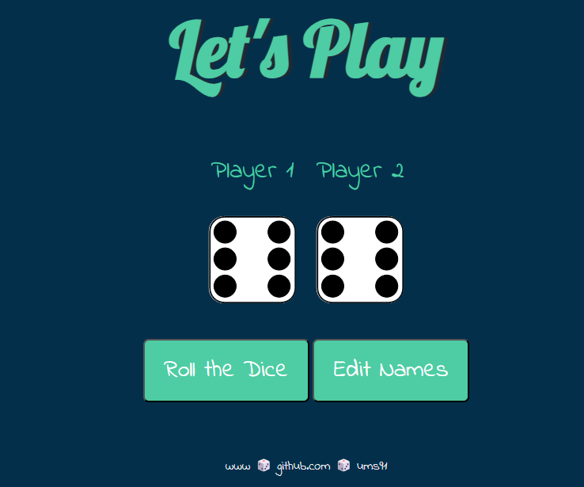

# Dice-Game
This is a simple web-based 2-Player dice game built using HTML, CSS, and JavaScript.
<h1> Play it here ➡️ https://ums91.github.io/Dice-Game/ </h1>
<h1> Introduction </h1>

This is a simple web-based dice game built using HTML, CSS, and JavaScript. The game allows two players to take turns rolling a pair of dice, and the player with the highest total wins the round. The game keeps track of the score and declares the winner at the end.

 

<h2> Technologies Used: </h2>
<ul> 
<li>HTML</li>
<li>CSS</li>
<li>JavaScript</li>
</ul>
<h2>How to Play:</h2>
<ul> 
<li>Clone the repository or download the source code.</li>
<li>Open the index.html file in a web browser or visit https://ums91.github.io/Dice-Game/ to Play.</li>
<li>The game will start automatically.</li>
<li>Edit names for Player1 & Player2 (optional).</li>
<li>Roll the Dice.</li> 
<li>The dice will display random numbers between 1 and 6.</li>
<li>Player 1's and 2's dice numbers will update accordingly.</li>
<li>The game will declare the winner the for each Roll of the Dice.</li>
<li>To play another round, simply refresh the page.</li>
</ul>
<h2> Features</h2>
<ul>
  
<li>Random dice roll for each player.</li>
<li>Score tracking for both players.</li>
<li>Winner declaration at the end of the round.</li>
<li>Simple and intuitive interface.</li>
</ul>

<h2>Contribution:</h2>

 Contributions are welcome! If you have any suggestions, bug reports, or improvements, please open an issue or submit a pull request.

<h2>License:</h2>

 This project is licensed under the MIT License.

<h2>Acknowledgements:</h2>

 This project was inspired by online dice games and was created as a learning exercise for HTML, CSS, and JavaScript.

<h2>Author:</h2>

 Ums91

